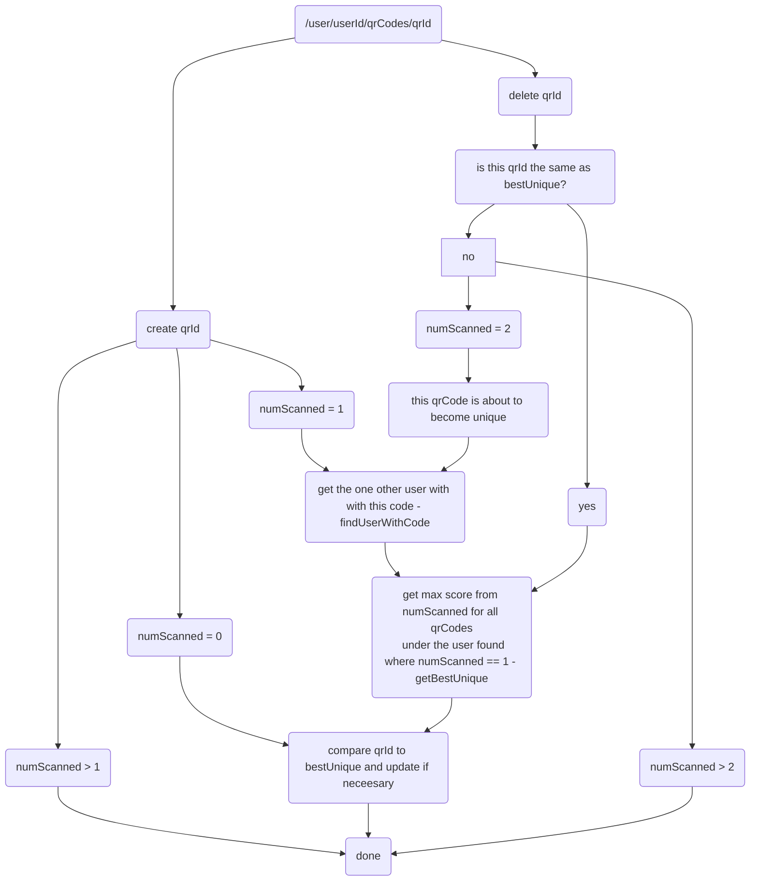

This repo contains the cloud functions that run on our Firestore instance to keep running totals of things like score and top QR code in one's account. To get started locally, run `npm i` in `./functions`. See https://firebase.google.com/docs/functions/get-started for more details. Initial setup steps have already been taken.

 - Firebase docs & examples: https://firebase.google.com/docs/functions/firestore-events
 - To deploy: `firebase deploy --only functions`
 - To view production logs: https://console.firebase.google.com/u/0/project/sandbox-266120/functions/logs?search=&severity=DEBUG

When in doubt, use docs often, and view the API reference online if you have to. They seem to be fairly thorough.

### Design overview

The cloud functions defined in this repo serve the purpose of aggregate functions missing from firebase. They aim to reduce r/w when possible, but still do multiply client side writes by a significant amount.  The strategy for maintaining user's highest scoring QR, user total score, and users total scanned is self-explanatory.

The strategy for maintaining any one users _best unique_ QR code revolves around the usage of numScanned in the qrCodesMetadata collection to determine if a qrCode is unique. The chart below provides an overview of the logic.

### Ranking/Leaderboard strategy

Since setting a new rank for a new player would require writing to every single player, this is done on a schedule 
rather than every insertion.
